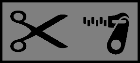

# ClipperZipper

ClipperZipper is a web scraping tool for retrieving chat logs from <a href="http://overrustlelogs.net/" target="_blank">OverRustleLogs</a>,
a website which logs the chat messages for several hundred <a href="http://twitch.tv/" target="_blank">Twitch</a> channels.

With ClipperZipper, you can retrieve logs from a specified time frame (the past X months/weeks/days/hours), and you can view the logs of 
multiple specified users at once. This makes viewing conversations in chat easy.

ClipperZipper is a [Flask](http://flask.pocoo.org/) app that runs using Python 3.6. 

